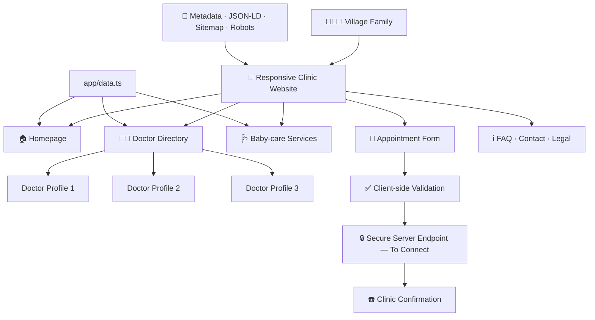
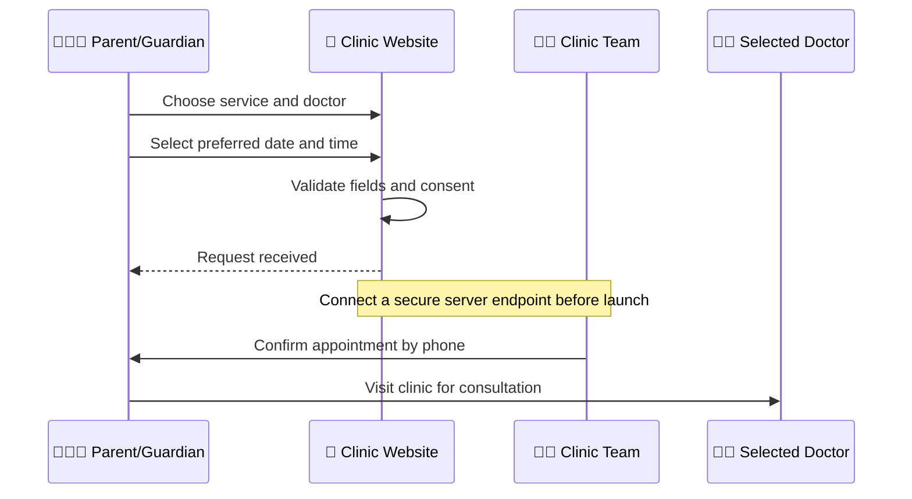

<div align="center">

# 👶 Nanhe Kadam Child Clinic

### Simple healthcare. Friendly guidance. Closer to every village family.

A modern, mobile-first baby and child-care clinic website designed for clear communication, easy appointment requests, trustworthy doctor profiles, and better access for rural families.

[](https://aarogya-family-clinic.rk1918.chatgpt.site)
[](https://www.typescriptlang.org/)
[](https://nextjs.org/)
[](#-accessibility)
[](#-quality-checks)

</div>

---

## 🌿 About the Project

**Nanhe Kadam Child Clinic** is a premium clinic website created for baby-care and village healthcare use cases. The experience uses large readable text, simple Hindi-English wording, clear navigation, child-friendly colours, and prominent Call and Appointment actions.

The project intentionally avoids invented doctor qualifications, patient counts, ratings, reviews, awards, or treatment claims. Fields that require client verification remain clearly marked until authentic information is supplied.

> [!IMPORTANT]
> The current clinic name, phone number, address, timings, doctor profiles, ratings, and reviews are launch placeholders. Replace them only with verified client information.

## ✨ Key Features

| Area | What is included |
|---|---|
| 👶 Child-friendly experience | Warm blue-and-white design, large text, clear cards, simple language |
| 🏡 Village-focused UX | Easy navigation for first-time and low-digital-literacy users |
| 📅 Appointment journey | Name, mobile, service, doctor, preferred date/time, consent and feedback |
| 👨‍⚕️ Doctor profiles | Three profile routes with qualification, registration, timing and rating fields |
| 🏥 Clinic presence | Village clinic exterior, reception counter, nurse, waiting area and doctor cabin |
| ⭐ Responsible reviews | Structure for verified ratings and consented patient reviews—no fake social proof |
| 📱 Mobile conversion | Fixed Call and Book controls, responsive menus and touch-friendly buttons |
| 🔎 Search readiness | Metadata, sitemap, robots, semantic content and medical-clinic structured data |
| ♿ Accessibility | Semantic HTML, labels, keyboard focus and reduced-motion support |
| 🔐 Safety basics | Form validation, privacy consent, honeypot and sensitive-data guidance |

## 🗺️ Website Pages

| Route | Purpose |
|---|---|
| `/` | Homepage, services, reception, doctors, reviews, FAQs and appointment CTAs |
| `/about` | Clinic philosophy and patient-friendly care principles |
| `/doctors` | Three doctor cards and verified-information notice |
| `/doctors/[slug]` | Individual doctor profile, details and appointment link |
| `/services` | Baby and child-care service overview |
| `/services/[slug]` | Service explanation, visit process and safety guidance |
| `/appointment` | Simple appointment request form |
| `/gallery` | Clinic and consultation visuals |
| `/testimonials` | Verified patient-review area |
| `/faq` | Appointment and clinic-visit questions |
| `/contact` | Phone, email, address, timings and future map area |
| `/blog` | Medical-review-first health education area |
| `/privacy-policy` | Enquiry privacy and data-handling guidance |
| `/terms` | Medical disclaimer, emergency guidance and website terms |

## 🏗️ Architecture



## 🧰 Technology Stack

- **Framework:** Next.js-compatible [Vinext](https://github.com/cloudflare/vinext)
- **Language:** TypeScript
- **UI:** React 19 + Tailwind CSS
- **Build tooling:** Vite
- **Deployment target:** Cloudflare Workers-compatible Sites output
- **Quality:** ESLint and production build verification

## 📁 Project Structure

```text
clinic_website/
├── app/
│   ├── [slug]/page.tsx              # General content pages
│   ├── appointment/
│   │   ├── AppointmentForm.tsx      # Interactive appointment form
│   │   └── page.tsx
│   ├── doctors/[slug]/page.tsx      # Individual doctor profiles
│   ├── services/[slug]/page.tsx     # Individual service pages
│   ├── components.tsx               # Header, footer, CTA and shared UI
│   ├── data.ts                      # Clinic, doctor, service and FAQ content
│   ├── globals.css                  # Design system and responsive styles
│   ├── layout.tsx                   # Metadata and structured data
│   ├── page.tsx                     # Homepage
│   ├── robots.ts
│   └── sitemap.ts
├── public/
│   ├── baby-doctor.png
│   ├── clinic-reception.png
│   ├── village-clinic.png
│   ├── og.png
│   └── favicon.svg
├── .openai/hosting.json
├── package.json
└── README.md
```

## 🚀 Getting Started

### Requirements

- Node.js **22.13.0 or newer**
- npm
- Git

### Installation

```bash
git clone https://github.com/iitdeveloper-git/clinic_website.git
cd clinic_website
npm install
```

### Start development

```bash
npm run dev
```

Open the local address shown in the terminal.

### Production checks

```bash
npm run lint
npm run build
```

### Start the production build locally

```bash
npm run start
```

## ⚙️ Client Customisation Checklist

Update the following verified information before public launch:

- [ ] Clinic’s final name and logo
- [ ] Main phone and WhatsApp numbers
- [ ] Complete address, landmark, village, district, state and PIN
- [ ] Opening hours and weekly closing day
- [ ] Google Maps location
- [ ] Three doctors’ real names and approved photographs
- [ ] Qualifications, specialties and registration numbers
- [ ] Verified experience and consultation timings
- [ ] Actual child-care services available at the clinic
- [ ] Consented patient reviews or Google Business Profile reviews
- [ ] Social media links
- [ ] Final domain name
- [ ] Jurisdiction-reviewed Privacy Policy and Terms

Most shared content is managed from:

```text
app/data.ts
```

Replace the example domain in:

```text
app/layout.tsx
app/robots.ts
app/sitemap.ts
```

## 📅 Appointment Flow



> [!WARNING]
> The current form demonstrates the user experience only. Connect it to a secure server-side email, CRM, or appointment service before accepting real enquiries.

## 🔐 Privacy & Healthcare Safety

- Do not collect reports, diagnoses or detailed medical history through the public form.
- Never expose API keys or credentials in browser code.
- Add server-side validation, sanitisation, rate limiting and CSRF protection.
- Restrict access to appointment enquiries to authorised clinic staff.
- Define a data-retention and deletion policy.
- Do not use the website for emergencies.
- Website content must not replace consultation, diagnosis or treatment from a qualified professional.

## ⭐ Ratings and Reviews Policy

Trust is essential in healthcare. This project therefore follows a strict rule:

- No fabricated ratings
- No invented testimonials
- No unsupported “best doctor” claims
- No fake patient counts
- No unverified qualifications or awards

Publish ratings only from a verifiable source, such as the clinic’s Google Business Profile or written patient consent. Keep evidence of consent and follow local privacy requirements.

## ♿ Accessibility

The interface includes:

- Semantic page structure
- Descriptive image alternative text
- Labelled form controls
- Visible keyboard focus
- Large touch targets
- Mobile-friendly typography
- Reduced-motion support
- Clear colour contrast
- Simple Hindi-English communication

## 🔎 SEO & Local Discovery

The project includes:

- Unique page titles and descriptions
- Open Graph and social-preview metadata
- `MedicalClinic`, `MedicalBusiness` and `WebSite` structured data
- XML sitemap generation
- Robots directives
- Search-friendly service and doctor URLs
- Internal links and semantic headings
- Local clinic identity fields ready for verified NAP data

**NAP** means the clinic’s **Name, Address and Phone**. Keep these details identical everywhere: website, Google Business Profile, directories and social pages.

## ✅ Quality Checks

Before each release:

```bash
npm run lint
npm run build
```

Also verify:

- Every navigation link and profile route
- Appointment validation and consent
- Call and contact links
- Mobile layouts
- Doctor and service metadata
- Sitemap and robots output
- No placeholder details remain
- No fake medical claims or reviews
- No browser console errors

## 🖼️ Visual Assets

The current clinic visuals are AI-generated project assets created for the prototype. Replace them with approved real clinic and doctor photography before the final public launch.

| Asset | Purpose |
|---|---|
| `public/baby-doctor.png` | Baby consultation hero |
| `public/clinic-reception.png` | Reception, nurse and waiting-area section |
| `public/village-clinic.png` | Village clinic exterior |
| `public/og.png` | Social sharing preview |

## 🤝 Contributing

1. Create a feature branch.
2. Make a focused change.
3. Run lint and the production build.
4. Avoid committing secrets or patient information.
5. Open a pull request with a clear description and screenshots when UI changes.

## 📦 Deployment

The project produces Cloudflare Workers-compatible output and is currently available at:

🌐 **Live:** [aarogya-family-clinic.rk1918.chatgpt.site](https://aarogya-family-clinic.rk1918.chatgpt.site)

For a client launch, configure the final verified domain and update canonical, sitemap, robots and structured-data URLs.

## 📄 Project Status

🟢 **UI and page architecture:** Ready
🟢 **Responsive design:** Ready
🟢 **Doctor profile routes:** Ready
🟢 **SEO foundation:** Ready
🟡 **Real clinic details:** Awaiting client verification
🟡 **Doctor credentials and ratings:** Awaiting verified data
🟡 **Appointment backend:** Ready to connect
🟡 **Real photography and reviews:** Awaiting client approval

---

<div align="center">

### Built with care for clearer, more accessible village healthcare 💙

**Nanhe Kadam Child Clinic** · Designed and developed by **IITDEVELOPER**

[🌐 Live Website](https://aarogya-family-clinic.rk1918.chatgpt.site) · [📂 Source Code](https://github.com/iitdeveloper-git/clinic_website)

</div>

