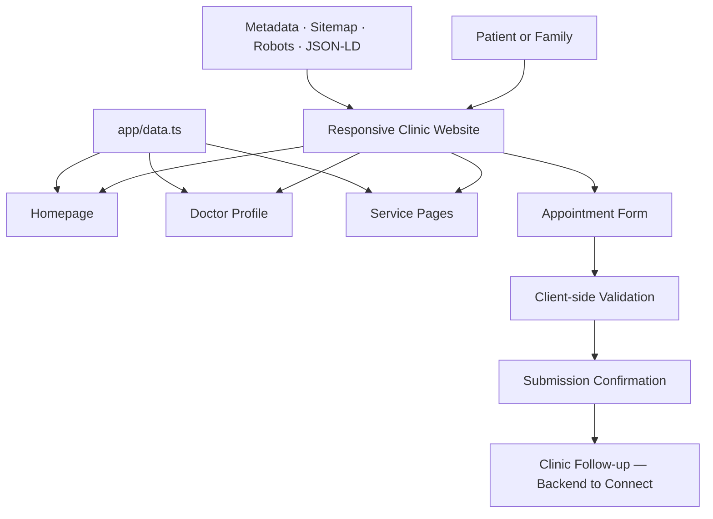

<div align="center">

# 🌸 Women’s Health Clinic

### Private care. Clear guidance. Every stage.

A premium, responsive gynecology clinic website with clear service information, a respectful appointment journey, and verified-detail placeholders for the clinic’s doctor and brand.

[](https://aarogya-family-clinic.rk1918.chatgpt.site)
[](https://www.typescriptlang.org/)

</div>

## 🌿 About

This project is a modern website foundation for a gynecologist or women’s health clinic. The navy-and-royal-blue visual system is inspired by premium healthcare design, while the content remains calm, readable, medically responsible, and easy to navigate on mobile.

> [!IMPORTANT]
> The clinic logo, doctor name, photograph, qualifications, registration number, ratings, contact details, address, and timings are placeholders until verified information is supplied. The project does not invent medical credentials, awards, testimonials, or “best doctor” claims.

## ✨ Features

| Area | Included |
|---|---|
| 🏠 Premium homepage | Hero, service highlights, doctor introduction, care pathways, process and FAQs |
| 👩‍⚕️ Doctor profile | Dedicated profile route ready for verified credentials and photography |
| 🌸 Women’s health services | Wellness, pregnancy, menstrual/PCOS, fertility, menopause and screening pages |
| 📅 Appointment flow | Patient details, preferred service, doctor, date and time, with confirmation page |
| 📱 Mobile experience | Responsive navigation, large touch targets, Call and WhatsApp actions |
| 🔎 Search foundation | Metadata, sitemap, robots and medical-clinic structured data |
| ♿ Accessible UI | Semantic HTML, labelled forms, keyboard focus and reduced-motion support |

## 🗺️ Pages

- `/` — complete clinic homepage
- `/about` — approach and care principles
- `/doctors` and `/doctors/lead-gynecologist` — doctor overview and profile
- `/services` and `/services/[slug]` — women’s health services
- `/appointment` and `/appointment/success` — booking and confirmation
- `/gallery`, `/testimonials`, `/faq`, `/blog`, `/contact`
- `/privacy-policy` and `/terms`

## 🏗️ Architecture



## 🧰 Stack

- React 19 and TypeScript
- Next.js-compatible Vinext runtime
- Tailwind CSS and custom responsive CSS
- Vite build tooling
- Cloudflare Workers-compatible deployment output

## 🚀 Run Locally

```bash
git clone https://github.com/iitdeveloper-git/clinic_website.git
cd clinic_website
npm install
npm run dev
```

Production checks:

```bash
npm run lint
npm run build
```

## ⚙️ Before Launch

- [ ] Add the approved logo and clinic name
- [ ] Add the doctor’s verified name, photo, qualifications and registration number
- [ ] Add real phone, WhatsApp, email, address, map and timings
- [ ] Confirm the services actually offered
- [ ] Add only consented, verifiable ratings or patient reviews
- [ ] Connect the appointment form to a secure server-side email, CRM or booking system
- [ ] Review medical, privacy and legal content for the clinic’s jurisdiction

Most shared content is maintained in `app/data.ts`.

## 🔐 Accessibility & Safety

- The public form avoids requesting reports, diagnoses or detailed medical history.
- Medical information is educational and does not replace consultation.
- Emergencies must use local emergency services, not the website form.
- Real appointment handling should add server-side validation, rate limiting, access controls and a retention policy.
- Ratings, qualifications and treatment claims must be supported by verifiable evidence.

## 🖼️ Visual Assets

`public/gynecologist-hero.png` is an original AI-generated prototype visual. Replace it with the approved doctor photograph before final launch. `public/og.png` is the social sharing preview.

## 📦 Status

- 🟢 Responsive UI and page architecture
- 🟢 Service and doctor routes
- 🟢 Appointment and confirmation experience
- 🟢 SEO and accessibility foundation
- 🟡 Verified doctor, logo and clinic details pending
- 🟡 Secure appointment backend pending

---

<div align="center">

**Women’s Health Clinic** · Designed and developed by **IITDEVELOPER**

[🌐 Live Website](https://aarogya-family-clinic.rk1918.chatgpt.site) · [📂 Source Code](https://github.com/iitdeveloper-git/clinic_website)

</div>
